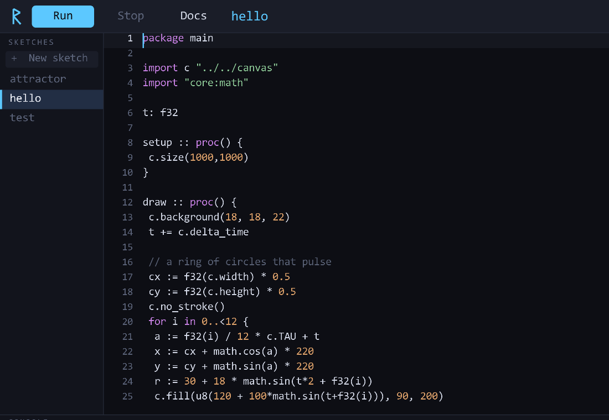
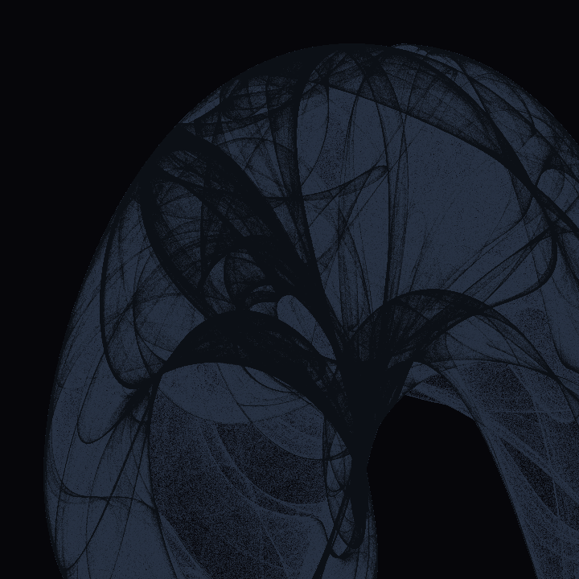
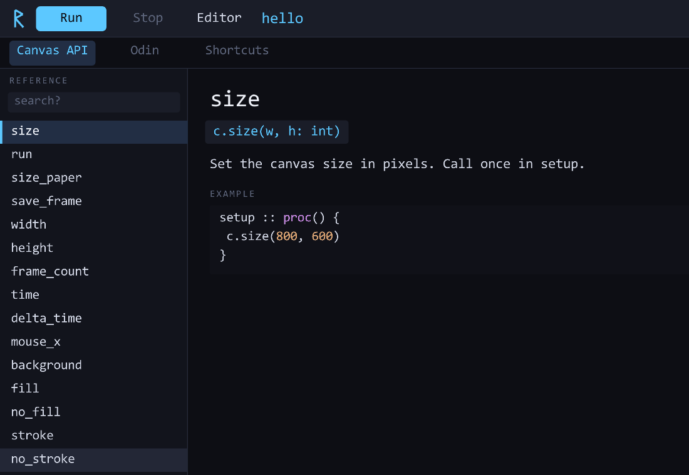

<div align="center">


# Rune

**Creative coding in [Odin](https://odin-lang.org) — native speed, Processing-simple.**

A self-contained studio for making generative art: a built-in code editor, a Processing-style `canvas` library, and one-key compile-and-run — backed by Odin's C-like directness and native performance.

[](LICENSE)




</div>

## Why Rune?

Processing and p5.js are wonderful for *starting*, but they hit a wall. Java and JavaScript can't keep up with the heavy stuff — millions of particles, strange attractors, real-time simulation. The moment your art gets computational, the frame rate falls off a cliff.

The native options solve the performance problem but ask a lot: **openFrameworks / Cinder** (C++) drag in decades of C++ complexity, and **Nannou** (Rust) is fast but has a steep learning curve and a heavier iteration loop.

**Rune fills the gap in the middle.** [Odin](https://odin-lang.org) is a modern systems language with C's directness and none of C++'s baggage or Rust's ceremony — built by a game developer, for graphics and simulation. Rune wraps it in a batteries-included studio so you don't assemble a toolchain: open the app, write `setup`/`draw`, hit **Run**.

It's for people who love C's simplicity, want native headroom for heavy generative work, and want a tool they can actually understand and shape.

|                       | Processing / p5 | openFrameworks / Cinder | Nannou | **Rune** |
| --------------------- | :-------------: | :---------------------: | :----: | :------: |
| Native performance    |        ✗        |            ✓            |   ✓    |    ✓     |
| Simple language       |        ✓        |            ✗ (C++)      |   ~    |  ✓ (Odin)|
| Built-in editor + run |        ✓        |            ✗            |   ✗    |    ✓     |
| Batteries included    |        ✓        |            ~            |   ~    |    ✓     |

## Features

- **Built-in editor** — syntax highlighting, `c.` autocomplete for the whole API, click-drag selection, copy/paste, undo/redo, adjustable font (Ctrl+wheel).
- **One-key run** — `Ctrl+R` compiles your sketch and launches it in its own window. Compile errors show inline in the console.
- **The `canvas` library** — a Processing-style API: shapes, HSL/HSV color, transforms, seedable random, Perlin noise, `Vec2` helpers, easing, and a persistent accumulation buffer (density plots & motion trails).
- **In-app reference** (`F1`) — searchable docs for every `canvas` function with examples, an Odin language cheatsheet, and a keyboard-shortcuts list. Press `F1` on a symbol to jump straight to it.
- **Print-ready** — paper-size presets (`c.size_paper(.A4, 300)`) and full-resolution PNG export (`Ctrl+S`).

## A sketch looks like this

```odin
package main

import c "../../canvas"
import "core:math"

t: f32

setup :: proc() {
	c.size(800, 800)
}

draw :: proc() {
	c.background(12, 12, 16)
	t += c.delta_time
	c.no_stroke()

	// a ring of pulsing circles
	cx, cy := f32(c.width)*0.5, f32(c.height)*0.5
	for i in 0..<12 {
		a := f32(i)/12 * c.TAU + t
		c.fill(c.hsl(f32(i)*30, 0.6, 0.6))
		c.circle(cx + math.cos(a)*220, cy + math.sin(a)*220, 40)
	}
}

main :: proc() {
	c.run(setup, draw)
}
```

<div align="center">


</div>

## Get started

### Download (Windows)

Grab the latest `rune-windows.zip` from the [**Releases**](../../releases) page, unzip, and run `rune.exe`. You'll need [Odin](https://odin-lang.org/docs/install/) on your `PATH` (Rune compiles your sketches with it).

### Build from source (Windows / Linux / macOS)

Rune needs the [Odin compiler](https://odin-lang.org/docs/install/) (which bundles raylib). Then:

```bash
# Windows
build.bat

# Linux / macOS
./build.sh
```

That builds and launches the IDE. To run a sketch directly without the IDE:

```bash
./build_sketch.sh hello      # or: build_sketch.bat hello
```

## How it works

Rune is small and legible — ~2,700 lines of Odin across four focused packages:

```
canvas/   the Processing-style drawing API + the run() window loop
editor/   a pure, unit-tested text-buffer model (cursor, selection, undo, tokenizer)
runner/   compile / launch / stop a sketch process
rune/     the IDE: editor view, docs, autocomplete, theme (package main)
sketches/ your sketches (each a standalone Odin program)
```

There is no hot-reload magic: a sketch is just a standalone Odin program that imports `canvas` and calls `c.run(setup, draw)`. The IDE compiles it with `odin build` and launches the resulting executable — the same **edit → Run → watch** loop as Processing.

## Roadmap

Rune is **v0.1** — early, but real. On the horizon:

- Pen-plotter **SVG export** (vector recording for physical plotting)
- More `canvas`: transforms stack, `begin_shape`/`vertex` paths, typography, images
- Editor: find/replace, multiple tabs, optional vim bindings
- GIF / MP4 recording

See [issues](../../issues) for the current list, and [CONTRIBUTING.md](CONTRIBUTING.md) to help.

## Contributing

Contributions are welcome — see [CONTRIBUTING.md](CONTRIBUTING.md). If you're an AI agent working on this repo, read [AGENTS.md](AGENTS.md) first.

## License

[zlib/libpng](LICENSE) — do anything you like, just don't misrepresent authorship. Chosen to match the ethos of [raylib](https://www.raylib.com) and the Odin ecosystem.

## Acknowledgements

Built on [Odin](https://odin-lang.org) and [raylib](https://www.raylib.com). Inspired by [Processing](https://processing.org), [p5.js](https://p5js.org), [canvas-sketch](https://github.com/mattdesl/canvas-sketch), and the mathematical art of [Paul Bourke](https://paulbourke.net). Named for the runes Odin won on Yggdrasil — the original symbols-as-code.
